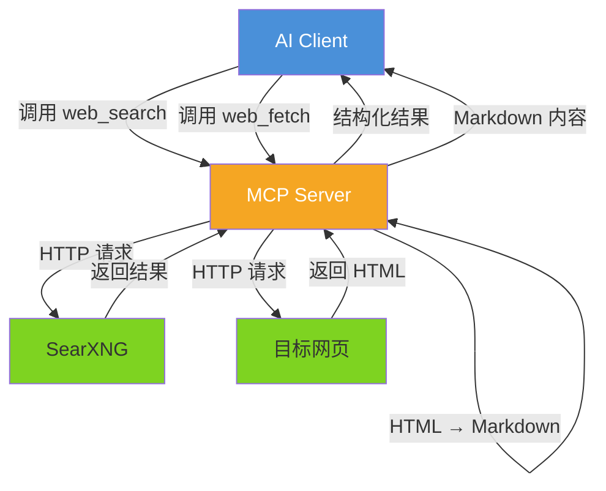

---
tags:
  - MCP
  - AI工具
  - 网页获取
  - 方案设计
aliases:
  - WebFetch MCP
  - 网页获取MCP
date: 2026-07-04
status: draft
type: 技术方案
---

# 网页数据获取 MCP 服务端技术方案

> [!abstract] 项目定位
> 将网页检索与内容提取能力封装为 MCP（Model Context Protocol）服务端，让 Claude Code、Cursor 等 AI 工具能直接调用联网搜索和网页获取能力。基于 TypeScript/Node.js 实现，使用官方 `@anthropic-ai/mcp` SDK。

> [!quote] 背景
> 之前帮朋友分析过一个基于 Python 的网页数据获取工具方案（SearXNG + httpx + Playwright），见 [[program/数据采集-分析-管理/02-网页数据获取工具]]。现在自己也需要这样的能力，但这次的目标更聚焦：不是做独立项目，而是做成一个 MCP Server，让 AI 工具开箱即用。

## 一、MCP 协议简介

> [!info] MCP 是什么
> MCP（Model Context Protocol）是 Anthropic 推出的开放协议，定义了 AI 模型与外部工具之间的标准化通信方式。通过 MCP，AI 工具可以调用外部服务提供的 tools、resources 和 prompts。

### 1.1 核心概念

```text
AI 工具（Claude Code / Cursor 等）
    ↕ stdio 或 SSE
MCP Server（本方案）
    ↕ HTTP
外部服务（搜索引擎 / 目标网站）
```

- **Server**：工具提供方，暴露 tools/resources/prompts
- **Client**：AI 工具（如 Claude Code），发现并调用 Server 的能力
- **传输方式**：stdio（本地进程）或 SSE（远程服务）

### 1.2 为什么选择 MCP

| 对比项 | MCP Server | 独立 CLI / API | Claude Code 内置工具 |
| ------ | ---------- | ------------- | ------------------- |
| **接入方式** | 配置即用，AI 自动发现 | 需要手动调用或集成 | 内置，无需配置 |
| **工具编排** | AI 自主决定调用时机 | 固定流程 | AI 自主决定 |
| **可定制性** | 完全可控 | 完全可控 | 受限于官方实现 |
| **复用性** | 所有 MCP Client 通用 | 仅当前项目 | 仅 Claude Code |
| **维护成本** | 需要自己维护 | 需要自己维护 | 零维护 |

> [!tip] 关键优势
> Claude Code 内置了 `WebFetch` 等工具，但它们是黑盒，无法定制搜索引擎、缓存策略、内容处理逻辑。MCP 方案在保持"AI 自主调用"便利性的同时，给了我们完全的控制权。

## 二、工具设计

### 2.1 暴露的 Tools

本 MCP Server 暴露以下工具给 AI Client：

| 工具名 | 功能 | 输入 | 输出 |
| ------ | ---- | ---- | ---- |
| **`web_search`** | 联网搜索 | 搜索关键词、结果数量、时间范围等 | 结构化搜索结果列表（title、url、snippet） |
| **`web_fetch`** | 获取网页内容 | URL、是否需要浏览器渲染 | Markdown 格式的网页内容 |
| **`web_search_and_fetch`** | 搜索 + 批量获取 | 搜索关键词、获取数量 | 搜索结果 + 各页面的 Markdown 内容 |

> [!note] 设计考量
> `web_search_and_fetch` 是一个复合工具，让 AI 用一次调用就能完成"搜索 → 筛选 → 获取"的完整流程，减少多轮工具调用的开销。但如果用户只需要搜索或只需要获取，也可以单独调用。

### 2.2 工具交互流程



## 三、技术选型

| 依赖 | 用途 | 选择理由 |
| ---- | ---- | -------- |
| `@anthropic-ai/mcp` | MCP 协议 SDK | 官方 SDK，TypeScript 一等公民支持 |
| `@modelcontextprotocol/sdk` | MCP TypeScript SDK | 官方 TypeScript SDK，提供 Server 基类 |
| `cheerio` | HTML 解析 | Node.js 生态最成熟的 HTML 解析库，类 jQuery API |
| `turndown` | HTML → Markdown | 高质量转换，可配置规则，比 markdownify 的 Node 替代品更成熟 |
| `node-fetch` / `undici` | HTTP 请求 | 原生 Node.js fetch（Node 18+）或 undici 做兼容 |
| `playwright` | 浏览器渲染（可选） | JS 渲染页面的降级方案 |
| `zod` | 参数校验 | MCP SDK 内置支持 zod schema 定义 |

### 开源项目简介

| 项目 | 说明 | 地址 |
| ---- | ---- | ---- |
| **MCP TypeScript SDK** | Anthropic 官方 MCP SDK，提供 Server/Client 基类和工具定义 | [modelcontextprotocol/typescript-sdk](https://github.com/modelcontextprotocol/typescript-sdk) |
| **SearXNG** | 隐私友好的元搜索引擎，聚合 Google/Bing 等 70+ 搜索源，自托管无调用限制 | [searxng/searxng](https://github.com/searxng/searxng) |
| **cheerio** | Node.js HTML 解析器，API 设计类似 jQuery | [cheeriojs/cheerio](https://github.com/cheeriojs/cheerio) |
| **Turndown** | HTML → Markdown 转换库，支持自定义转换规则 | [nickvdp/turndown](https://github.com/nickvdp/turndown) |
| **Playwright** | 微软出品浏览器自动化框架，Node.js 原生支持 | [microsoft/playwright](https://github.com/microsoft/playwright) |

## 四、工作流设计

### 4.1 web_search 工作流

```text
关键词 → [搜索服务] → [结果过滤] → [返回结构化结果]
```

#### 搜索后端：SearXNG

使用自托管的 SearXNG 元搜索引擎，聚合 Google、Bing、DuckDuckGo 等 70+ 搜索源，无调用限制。

#### SearXNG 部署指南

> [!info] 说明
> SearXNG 是 `web_search` 工具的外部依赖，需要自行部署。以下为服务器部署流程。

**1. Docker 部署**

```bash
# 拉取并启动
docker run -d \
  --name searxng \
  --restart unless-stopped \
  -p 8080:8080 \
  -v ./searxng-data:/etc/searxng \
  searxng/searxng:latest

# 验证启动
curl http://localhost:8080/search?q=test&format=json
```

**2. 配置调整**

SearXNG 默认配置禁用了部分搜索引擎的 JSON API，需编辑 `searxng-data/settings.yml`：

```yaml
search:
  safe_search: 0            # 0=关闭安全搜索，1=中等，2=严格
  autocomplete: ""          # 关闭自动补全（减少不必要请求）
  default_lang: "zh-CN"     # 默认搜索语言

# 启用需要的搜索引擎（按需开启，并非所有都需要）
engines:
  - name: google
    engine: google
    shortcut: g
  - name: bing
    engine: bing
    shortcut: b
  - name: duckduckgo
    engine: duckduckgo
    shortcut: ddg
  - name: wikipedia
    engine: wikipedia
    shortcut: wp

server:
  secret_key: "your-secret-key-here"  # 生成方式见下方
  bind_address: "0.0.0.0"
  port: 8080
  limiter: false                       # 关闭请求限流
```

> [!warning] secret_key 必须设置
> SearXNG 启动时会检查 `secret_key` 是否为默认值，如果是则拒绝启动。生成方式：
> ```bash
> openssl rand -hex 32
> ```

**3. 服务器安全加固（推荐）**

如果 SearXNG 部署在公网服务器上，建议通过 Nginx 反代并限制访问来源：

```nginx
server {
    listen 80;
    server_name search.yourdomain.com;

    # 仅允许 MCP Server 所在机器访问
    allow YOUR_SERVER_IP;
    deny all;

    location / {
        proxy_pass http://127.0.0.1:8080;
        proxy_set_header Host $host;
        proxy_set_header X-Real-IP $remote_addr;
    }
}
```

> [!tip] 也可以不对外暴露
> 如果 MCP Server 和 SearXNG 在同一台服务器上，无需 Nginx，直接用 `http://localhost:8080` 或 `http://127.0.0.1:8080` 通信即可。

#### 搜索后端接口抽象

```typescript
// 搜索后端接口抽象
interface SearchProvider {
  search(query: string, options: SearchOptions): Promise<SearchResult[]>;
}

interface SearchOptions {
  maxResults?: number;    // 最大结果数，默认 10
  timeRange?: 'day' | 'week' | 'month' | 'year';
  language?: string;     // 搜索语言偏好
}

interface SearchResult {
  title: string;
  url: string;
  snippet: string;
  engine?: string;        // 来源引擎（SearXNG 时填充）
}
```

#### 结果过滤

| 过滤项 | 说明 |
| ------ | ---- |
| URL 去重 | 基于 canonical URL 去重 |
| 域名过滤 | 白名单/黑名单 |
| 时间范围 | 按搜索引擎支持的时间范围过滤 |

### 4.2 web_fetch 工作流

```text
URL → [URL 安全校验] → [HTTP 请求] → [HTML → Markdown] → [内容截断] → 返回
                         ↓ 失败/内容为空
                    [Playwright 渲染]（可选降级）
```

#### URL 安全校验

与原方案一致，这是必须的安全措施：

| 校验项 | 规则 |
| ------ | ---- |
| URL 长度 | 超过 2000 字符拒绝 |
| 凭据检测 | 禁止 `user:pass@host` 格式 |
| Hostname | 禁止 localhost / 内网地址（127.0.0.0/8、10.0.0.0/8、172.16.0.0/12、192.168.0.0/16） |
| 协议 | 仅允许 http / https |

```typescript
function validateUrl(url: string): void {
  const parsed = new URL(url);
  if (parsed.protocol !== 'http:' && parsed.protocol !== 'https:') {
    throw new Error(`不支持的协议: ${parsed.protocol}`);
  }
  if (parsed.password || parsed.username) {
    throw new Error('禁止在 URL 中携带凭据');
  }
  // 内网地址检查
  const hostname = parsed.hostname;
  if (isPrivateNetwork(hostname)) {
    throw new Error('禁止访问内网地址');
  }
}
```

#### HTTP 请求策略

| 参数 | 默认值 | 说明 |
| ---- | ------ | ---- |
| 超时 | 30s | 单次请求超时 |
| 最大响应大小 | 5MB | 超过则截断 |
| 跟随重定向 | 同域跟随，跨域不跳转 | 最多 5 次 |
| User-Agent | 自定义（标识为 MCP 工具） | 避免被部分站点拦截 |

#### HTML → Markdown 转换

```typescript
import TurndownService from 'turndown';
import cheerio from 'cheerio';

function htmlToMarkdown(html: string, url: string): string {
  const $ = cheerio.load(html);

  // 提取正文区域（去除导航、页脚、侧边栏等噪音）
  $('script, style, nav, footer, header, aside, noscript, iframe').remove();

  // 尝试定位主内容区域
  const mainContent =
    $('article').html() ||
    $('main').html() ||
    $('[role="main"]').html() ||
    $.html();

  const turndown = new TurndownService({
    headingStyle: 'atx',
    bulletListMarker: '-',
    codeBlockStyle: 'fenced',
  });

  // 处理相对路径 → 绝对路径
  turndown.addRule('fixRelativeLinks', {
    filter: 'a',
    replacement: (content, node) => {
      const href = $(node).attr('href');
      const absoluteHref = resolveUrl(url, href);
      return `[${content}](${absoluteHref})`;
    },
  });

  return turndown.turndown(mainContent);
}
```

> [!tip] 设计理由
> Markdown 对 LLM 更友好——统一格式、去除 HTML 标签噪音、保留语义结构。相比直接返回原始 HTML，Markdown 能显著降低 token 消耗并提高 AI 的理解准确度。

#### 内容截断

```typescript
const MAX_CONTENT_SIZE = 100 * 1024; // 100KB

function truncateContent(markdown: string): string {
  const bytes = Buffer.byteLength(markdown, 'utf-8');
  if (bytes <= MAX_CONTENT_SIZE) return markdown;
  return (
    Buffer.from(markdown, 'utf-8')
      .subarray(0, MAX_CONTENT_SIZE)
      .toString('utf-8') + '\n\n[内容已截断，原文约 ' + (bytes / 1024).toFixed(1) + 'KB]'
  );
}
```

#### Browser 降级（可选）

当 HTTP 请求获取的页面内容为空或过短（如 SPA、JS 渲染页面），可自动降级到 Playwright：

```typescript
async function fetchWithBrowser(url: string): Promise<string> {
  const browser = await chromium.launch({ headless: true });
  const page = await browser.newPage();
  await page.goto(url, { waitUntil: 'networkidle' });
  await page.waitForTimeout(2000);
  const html = await page.content();
  await browser.close();
  return html;
}
```

> [!warning] 性能注意
> Playwright 启动浏览器进程开销较大（约 1-3s 冷启动），应作为降级方案而非默认路径。建议在配置中控制是否启用。

### 4.3 web_search_and_fetch 复合工作流

```text
关键词 → [搜索] → [AI 选择目标 URL] → [批量 Fetch] → [合并返回]
```

这个工具将搜索和获取合并为一次调用，AI 只需要指定关键词和期望获取的页面数量：

```typescript
interface SearchAndFetchOptions {
  query: string;            // 搜索关键词
  fetchCount?: number;      // 获取前 N 个结果的内容，默认 3
  searchMaxResults?: number; // 搜索结果数量，默认 10
  timeRange?: string;
}
```

## 五、MCP Server 实现

### 5.1 项目结构

```text
web-fetch-mcp/
├── package.json
├── tsconfig.json
├── src/
│   ├── index.ts              # 入口，MCP Server 启动
│   ├── tools/
│   │   ├── web-search.ts     # web_search 工具实现
│   │   ├── web-fetch.ts      # web_fetch 工具实现
│   │   └── search-and-fetch.ts # web_search_and_fetch 复合工具
│   ├── search/
│   │   ├── provider.ts       # SearchProvider 接口定义
│   │   └── searxng.ts        # SearXNG 后端实现
│   ├── fetch/
│   │   ├── http-fetch.ts     # HTTP 获取 + HTML→MD
│   │   ├── browser-fetch.ts # Playwright 获取（可选降级）
│   │   └── url-validator.ts  # URL 安全校验
│   └── utils/
│       ├── cache.ts          # LRU 缓存
│       └── config.ts         # 配置管理
└── README.md
```

### 5.2 工具注册示例

```typescript
import { McpServer } from '@anthropic-ai/mcp';
import { z } from 'zod';

const server = new McpServer({
  name: 'web-fetch',
  version: '0.1.0',
});

// 注册 web_search 工具
server.tool(
  'web_search',
  '联网搜索，返回关键词匹配的网页列表',
  {
    query: z.string().describe('搜索关键词'),
    maxResults: z.number().optional().default(10).describe('最大返回结果数'),
    timeRange: z.enum(['day', 'week', 'month', 'year']).optional()
      .describe('时间范围过滤'),
  },
  async ({ query, maxResults, timeRange }) => {
    const results = await searchProvider.search(query, { maxResults, timeRange });
    return {
      content: [{ type: 'text', text: JSON.stringify(results, null, 2) }],
    };
  }
);

// 注册 web_fetch 工具
server.tool(
  'web_fetch',
  '获取指定 URL 的网页内容，返回 Markdown 格式',
  {
    url: z.string().url().describe('目标网页 URL'),
    useBrowser: z.boolean().optional().default(false)
      .describe('是否使用浏览器渲染（用于 JS 动态页面）'),
  },
  async ({ url, useBrowser }) => {
    validateUrl(url);
    const html = useBrowser
      ? await fetchWithBrowser(url)
      : await fetchWithHttp(url);
    const markdown = htmlToMarkdown(html, url);
    const content = truncateContent(markdown);
    return {
      content: [{ type: 'text', text: content }],
    };
  }
);
```

### 5.3 配置方式

MCP Server 的配置通过**环境变量**传递，不使用 YAML 配置文件，保持 MCP 的轻量理念：

```bash
# 搜索后端配置
SEARXNG_URL=http://localhost:8080  # SearXNG 实例地址（必填）

# Fetch 配置
FETCH_TIMEOUT=30000               # HTTP 请求超时（ms）
MAX_RESPONSE_SIZE=5242880        # 最大响应大小（bytes）
AUTO_BROWSER_FALLBACK=false       # HTTP 获取失败时是否自动降级到浏览器

# 缓存配置
CACHE_ENABLED=true
CACHE_TTL=900                     # 缓存过期时间（秒）
CACHE_MAX_SIZE=52428800          # 缓存上限（bytes）

# 域名管理
ALLOWED_DOMAINS=                  # 域名白名单（逗号分隔，空则不限制）
BLOCKED_DOMAINS=                  # 域名黑名单
```

## 六、Claude Code 接入配置

MCP Server 开发完成后，在 Claude Code 的 MCP 配置中添加即可使用：

```json
{
  "mcpServers": {
    "web-fetch": {
      "command": "node",
      "args": ["/path/to/web-fetch-mcp/dist/index.js"],
      "env": {
        "SEARXNG_URL": "http://localhost:8080"
      }
    }
  }
}
```

## 七、与现有方案的对比

> [!abstract] 方案定位
> 本方案不是替代品，而是对 Claude Code 内置 WebFetch 能力的**定制化补充**。

| 能力 | Claude Code 内置 WebFetch | 本 MCP 方案 |
| ---- | ----------------------- | ----------- |
| **搜索引擎** | 不支持（仅获取已知 URL） | SearXNG（自托管，无限制） |
| **网页获取** | ✅ 支持 | ✅ 支持 |
| **HTML → Markdown** | 内置实现 | 可自定义（主内容提取、噪音过滤） |
| **内容截断** | 内置策略 | 可配置阈值 |
| **浏览器渲染** | 不支持 | Playwright 降级 |
| **缓存** | 未知 | LRU 缓存，可配置 TTL |
| **域名管理** | 未知 | 白名单/黑名单 |
| **搜索 + 获取** | 需两次调用 | 一次 `web_search_and_fetch` 完成 |

## 八、风险与注意事项

| 风险                | 说明                           | 应对策略                              |
| ----------------- | ---------------------------- | --------------------------------- |
| **SearXNG 实例稳定性** | 自托管需自行维护，Docker 容器挂掉会导致搜索不可用 | `--restart unless-stopped` + 健康检查 |
| **反爬拦截**          | 目标网站可能拒绝 MCP 请求              | 自定义 User-Agent、域名预批准、降级到 Browser  |
| **内容截断**          | 长页面截断会丢失尾部内容                 | 配置更高阈值或让 AI 分段获取                  |
| **Browser 资源**    | Playwright 启动开销大（1-3s）       | 默认关闭，按需启用或自动降级                    |
| **XSS / SSRF**    | URL 注入攻击                     | 严格的 URL 安全校验（SSRF 黑名单、协议限制）       |
| **MCP SDK 稳定性**   | SDK 仍在迭代中                    | 关注版本更新，锁定依赖版本                     |

## 九、后续扩展方向

- [ ] **结果缓存持久化**：当前 LRU 缓存在进程重启后丢失，可考虑 SQLite 持久化
- [ ] **内容结构化提取**：基于 LLM 从 Markdown 中提取结构化字段（可选功能）
- [ ] **RAG 集成**：获取的内容直接送入本地向量索引，供后续检索
- [ ] **速率限制**：对同一域名设置请求间隔，避免触发反爬

---

> [!quote] 参考
> - [[program/数据采集-分析-管理/02-网页数据获取工具]] — 之前的 Python 方案设计（本方案的参考蓝本）
> - MCP 官方文档：[modelcontextprotocol.io](https://modelcontextprotocol.io/)
> - MCP TypeScript SDK：[github.com/modelcontextprotocol/typescript-sdk](https://github.com/modelcontextprotocol/typescript-sdk)
